🐠 <b>Apprentice Software Developer</b> (Fachinformatiker für Anwendungsentwicklung) · 🇩🇪 Germany 
Building backends with <b>C# / ASP.NET</b> and frontends with <b>Svelte / SvelteKit</b>.

<!-- MISSIONS:START -->

<!-- MISSIONS:END -->

  

